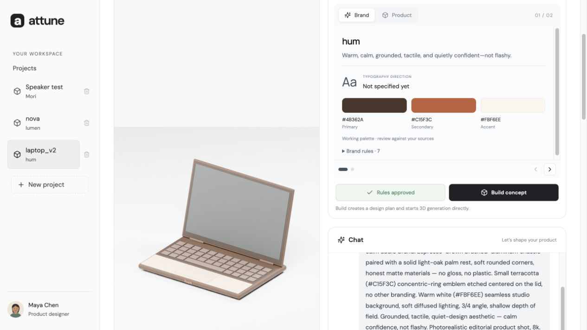
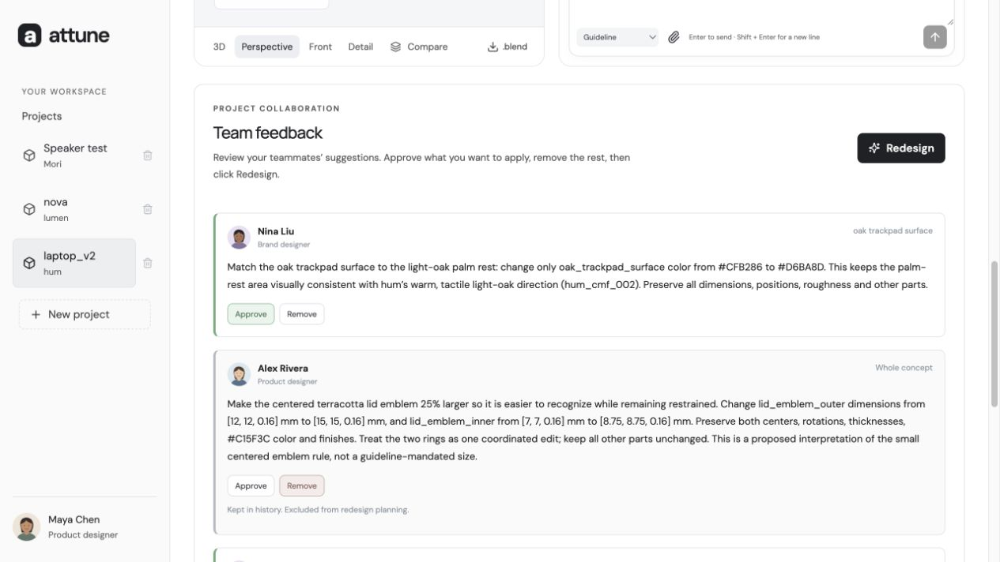

# Attune — Generate 3D products for your brand

Attune turns brand guidelines and a conversational product brief into an editable 3D product concept. Instead of asking only “generate a laptop,” a designer can ask “generate a laptop for our brand.”

**The current MVP focuses on one core feature: brand-aware 3D generation.** Teammate feedback supports the same design-and-iteration workflow: the designer reviews suggestions, decides which to apply, and approves a new version. It is not a separate, fully built collaboration platform.

## The workflow

1. **Share your direction.** Upload brand guidelines, a logo, references or a moodboard, and describe the product in Chat.
2. **Review the understanding.** Attune organizes the brand palette, typography, rules and product brief into cards. Clarify the direction through Chat, then approve the rules.
3. **Generate a concept.** Click Build concept to create an editable Blender scene, interactive 3D preview and three rendered views.
4. **Evaluate teammate feedback.** Review comments with names and avatars. Approve suggestions you want to include and remove those you do not want to apply.
5. **Decide whether to iterate.** Click Redesign to see the proposed changes. Only accepted comments inform the plan; conflicting or unsupported requests block rebuilding. Click Rebuild when you agree with the summary.
6. **Compare versions.** Inspect the new concept against its source and open the history to see what changed. The original stays saved.

A comment is a suggestion, not permission to edit. No feedback-driven model change happens until the designer presses **Rebuild**. For personal revisions, designers can update the direction in Chat and generate another concept.

## Screenshots

Fresh captures of the local **hum laptop** example. These show the actual interface; reviewer names and avatars are fictional demo identities. Example projects and comments are local data, not bundled with a fresh checkout.

**Generate a product from brand context** — the laptop concept alongside hum’s palette, design direction and Chat.



**Choose which feedback to apply** — reviewer comments retain their Approve/Remove decisions before the designer requests a redesign.



## What is implemented

- Separate projects with saved sources, conversations, rules, versions and feedback.
- Queued uploads that are sent only after Send, with immediate composer clearing and visible waiting states.
- Brand/Product understanding cards and direct rule approval and concept generation.
- Component-based 3D concepts, a GLB viewer, three renders and downloadable `.blend` files.
- Comment decisions, accepted-feedback planning, explicit rebuild approval and verification of supported edits.
- Before/after comparison and expandable concept history.

**Feedback scope:** the review-and-redesign flow works with locally stored comments. For the demo, teammate comments are preloaded samples with names and avatars. There is no teammate login, invitation, publishing workflow or reviewer-facing comment form yet. The backend supports creating local comments, but the full teammate submission experience remains future work.

The generator has been exercised locally with speakers, portable chargers and laptops. It creates editable visual concepts from geometric components; it does not produce production CAD or validate engineering performance. Broader capabilities discussed in the [PRD](docs/PRD.md) should not be read as completed features.

## Local setup

Prerequisites: Python compatible with the pinned dependencies, Node.js/npm, and Blender. The current local environment has used Python 3.14 and Blender 5.0.1 on macOS; other environments have not been verified here.

```sh
python3 -m venv .venv
.venv/bin/pip install -r requirements.txt
npm ci
cp .env.example .env.local
```

Edit `.env.local` locally:

- `OPENAI_API_KEY`: your API key.
- `OPENAI_MODEL`: an exact Responses API model ID available to your account, with image input and structured-output support.
- `BLENDER_PATH`: your Blender executable; the default is `/Applications/Blender.app/Contents/MacOS/Blender`.

The backend automatically loads `.env.local`; existing process environment values take precedence. Never place keys in frontend code or commit this file. Without AI configuration, automated chat interpretation and generation are disabled.

### Blender connection

Install/enable the Blender MCP addon matching the pinned `blender-mcp` package, open Blender, and start the addon's server on `127.0.0.1:9876`. See the [Blender MCP project](https://github.com/ahujasid/blender-mcp) for addon installation. Installing the Python dependencies alone does not enable the GUI addon.

The backend invokes `.venv/bin/blender-mcp` through the MCP Python client and prefers the running GUI. Telemetry is disabled for that subprocess. Only checked-in worker scripts are invoked; model output is validated data, not executable Python. If the socket is unavailable, generation attempts background Blender. Background execution has failed with Metal initialization on the development Mac, so the GUI route is recommended for the demo.

### Run the built application

```sh
npm run build
.venv/bin/uvicorn backend.main:app --host 127.0.0.1 --port 8001 --no-access-log
```

Open [localhost:8001](http://127.0.0.1:8001/). Keep the terminal and Blender running.

For hot-reload frontend development, the existing Vite proxy targets backend port **8000**:

```sh
# Terminal 1
.venv/bin/uvicorn backend.main:app --host 127.0.0.1 --port 8000
# Terminal 2
npm run dev
```

Open the Vite URL, normally [localhost:5173](http://127.0.0.1:5173/).

## Using the workspace

1. Create a project. Attach guidelines or references and describe the product in Chat.
2. Press Send. The AI organizes brand/product context and asks follow-up questions.
3. Review the cards, clarify through Chat, then approve the rules.
4. Click Build concept. The app creates and validates a component plan and starts Blender without another plan-approval modal.
5. Explore the model and renders, download the Blender scene, or compare saved versions.
6. For your own revisions, update the direction in Chat, review the updated rules, and build another concept. Chat alone does not modify geometry or guarantee narrowly scoped edits.
7. For existing team feedback, approve or remove every comment, click Redesign, inspect the summary, then click Rebuild. Conflicts and unsupported changes must be resolved first.

A fresh checkout does not contain the local sample projects, comments, uploads, or rendered scenes. The comment creation/sample-seeding endpoints remain in the backend for local fixtures; there is no comment composer or sample-loading button in the current UI.

## Architecture and storage

| Location | Responsibility |
|---|---|
| `frontend/src/main.tsx`, `style.css` | React workspace, chat, project controls, feedback, history |
| `frontend/src/Viewer.tsx` | Three.js GLB viewer |
| `backend/main.py` | FastAPI, SQLite state, intake, model calls, job orchestration |
| `backend/redesign.py` | Feedback decisions, proposal validation, approval binding |
| `backend/mcp_bridge.py` | Local Blender MCP transport |
| `blender/product.py`, `scene.py` | Component generation, manifests, GLB and renders |
| `blender/redesign.py` | Approved edits to a source copy and scene verification |
| `data/workspace.sqlite` | Local project records |
| `data/uploads/` | Uploaded source files |
| `outputs/demo/<version>/` | Scene, GLB, three renders, manifest, request and worker log; verification for redesigns |

Blender work is serialized across projects. The service is designed for a trusted local machine, with no authentication. It is not ready for public hosting.

## Checks

```sh
npm run build
.venv/bin/python -m unittest discover -s backend -p 'test_*.py'
```

The backend suite currently contains 31 tests. Unit tests cover state isolation, intake, history, component validation, feedback/approval guards and error handling. They do not render Blender scenes. Real rendering requires a separate live check with Blender and API access.

If generation fails, inspect the UI error and the version's `worker.log`. AI failures retain already saved messages and uploads; use **Retry understanding**. A failed redesign keeps the source version current. A reachable Blender socket does not prove a job will succeed.

## Scope and documentation

Supported geometry uses boxes, cylinders, spheres, cones and tori with editable transforms, materials and bevels. Complex reconstruction, functional internals, manufacturing tolerances, brand-compliance certification, budget estimation, and deadline-risk scoring are not implemented. Legacy Vela speaker/demo review APIs remain and are not generic product validation.

- [Current PRD](docs/PRD.md) — implementation-aligned scope and acceptance criteria.
- [Generation workflow](docs/GENERATION_MVP.md) — concise flow reference.
- [Team alignment idea](docs/TEAM_ALIGNMENT_IDEA.md) — deferred direction.
- [Contributing](CONTRIBUTING.md) — collaboration workflow.

`.env.local`, `data/`, `outputs/`, `work/`, dependencies, and build artifacts are excluded from Git. Only `.env.example` is committed as an empty configuration template.
