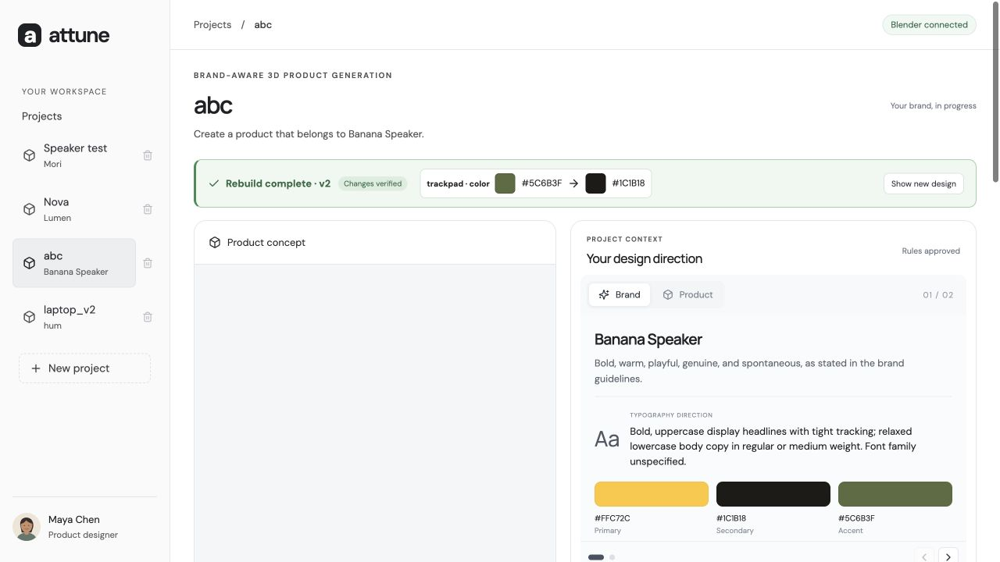

# Attune — Brand-aware 3D product concepts

Attune is a local design workspace that turns brand guidelines and a conversational product brief into an editable Blender concept. Designers review the brand direction, build a concept, and evaluate version-specific feedback before approving a rebuild.

The current implementation supports declarative product components rather than a speaker-only template. It has been exercised locally with speakers, portable chargers, and a laptop. These are visual concepts, not production CAD or validated engineering designs.

## Screenshots

Actual screenshots from the local laptop example. Reviewer/profile identities are fictional, and example projects are not included in a fresh checkout.

**Concept comparison and Chat** — review the original and rebuilt laptop alongside the conversation that defines the product.


**Brand understanding** — source-informed direction, typography and palette, with a compact rebuild change summary.



## What works today

- Separate projects with their own sources, conversation, rules, concept versions, and feedback. Project deletion hides the project while retaining local data.
- Chat-based intake with queued guideline, logo, reference, and moodboard attachments. Files are submitted only when Send is pressed; Enter sends and Shift+Enter inserts a newline.
- Brand/Product summary cards with palette, typography, brief, constraints, and source-attributed rules. New projects start without seeded brand content.
- Direct **Review & approve rules → Build concept** actions, with preparation and rendering indicators.
- Interactive GLB, front/perspective/detail renders, downloadable `.blend`, source comparison, and concept history with expandable changes.
- **Team feedback:** Approve/Remove decisions, accepted-comment redesign planning, a change-summary dialog, and explicit **Rebuild** approval.
- Restricted component edits with before/after verification and preservation of the source scene.

Team feedback currently uses locally stored comments and optional sample reviewer names/illustrated avatars. There is no teammate login, publishing workflow, invitation, remote comment submission UI, or role-based authorization. The sidebar identity is a fictional presentation profile.

## Local setup

Prerequisites: Python compatible with the pinned dependencies, Node.js/npm, and Blender. The current local environment has used Python 3.14 and Blender 5.0.1 on macOS; other environments have not been verified here.

```sh
python3 -m venv .venv
.venv/bin/pip install -r requirements.txt
npm ci
cp .env.example .env.local
```

Edit `.env.local` locally:

- `OPENAI_API_KEY`: your API key.
- `OPENAI_MODEL`: an exact Responses API model ID available to your account, with image input and structured-output support.
- `BLENDER_PATH`: your Blender executable; the default is `/Applications/Blender.app/Contents/MacOS/Blender`.

The backend automatically loads `.env.local`; existing process environment values take precedence. Never place keys in frontend code or commit this file. Without AI configuration, automated chat interpretation and generation are disabled.

### Blender connection

Install/enable the Blender MCP addon matching the pinned `blender-mcp` package, open Blender, and start the addon's server on `127.0.0.1:9876`. See the [Blender MCP project](https://github.com/ahujasid/blender-mcp) for addon installation. Installing the Python dependencies alone does not enable the GUI addon.

The backend invokes `.venv/bin/blender-mcp` through the MCP Python client and prefers the running GUI. Telemetry is disabled for that subprocess. Only checked-in worker scripts are invoked; model output is validated data, not executable Python. If the socket is unavailable, generation attempts background Blender. Background execution has failed with Metal initialization on the development Mac, so the GUI route is recommended for the demo.

### Run the built application

```sh
npm run build
.venv/bin/uvicorn backend.main:app --host 127.0.0.1 --port 8001 --no-access-log
```

Open [localhost:8001](http://127.0.0.1:8001/). Keep the terminal and Blender running.

For hot-reload frontend development, the existing Vite proxy targets backend port **8000**:

```sh
# Terminal 1
.venv/bin/uvicorn backend.main:app --host 127.0.0.1 --port 8000
# Terminal 2
npm run dev
```

Open the Vite URL, normally [localhost:5173](http://127.0.0.1:5173/).

## Using the workspace

1. Create a project. Attach guidelines or references and describe the product in Chat.
2. Press Send. The AI organizes brand/product context and asks follow-up questions.
3. Review the cards, clarify through Chat, then approve the rules.
4. Click Build concept. The app creates and validates a component plan and starts Blender without another plan-approval modal.
5. Explore the model and renders, download the Blender scene, or compare saved versions.
6. For your own revisions, update the direction in Chat, review the updated rules, and build another concept. Chat alone does not modify geometry or guarantee narrowly scoped edits.
7. For existing team feedback, approve or remove every comment, click Redesign, inspect the summary, then click Rebuild. Conflicts and unsupported changes must be resolved first.

A fresh checkout does not contain the local sample projects, comments, uploads, or rendered scenes. The comment creation/sample-seeding endpoints remain in the backend for local fixtures; there is no comment composer or sample-loading button in the current UI.

## Architecture and storage

| Location | Responsibility |
|---|---|
| `frontend/src/main.tsx`, `style.css` | React workspace, chat, project controls, feedback, history |
| `frontend/src/Viewer.tsx` | Three.js GLB viewer |
| `backend/main.py` | FastAPI, SQLite state, intake, model calls, job orchestration |
| `backend/redesign.py` | Feedback decisions, proposal validation, approval binding |
| `backend/mcp_bridge.py` | Local Blender MCP transport |
| `blender/product.py`, `scene.py` | Component generation, manifests, GLB and renders |
| `blender/redesign.py` | Approved edits to a source copy and scene verification |
| `data/workspace.sqlite` | Local project records |
| `data/uploads/` | Uploaded source files |
| `outputs/demo/<version>/` | Scene, GLB, three renders, manifest, request and worker log; verification for redesigns |

Blender work is serialized across projects. The service is designed for a trusted local machine, with no authentication. It is not ready for public hosting.

## Checks

```sh
npm run build
.venv/bin/python -m unittest discover -s backend -p 'test_*.py'
```

The backend suite currently contains 31 tests. Unit tests cover state isolation, intake, history, component validation, feedback/approval guards and error handling. They do not render Blender scenes. Real rendering requires a separate live check with Blender and API access.

If generation fails, inspect the UI error and the version's `worker.log`. AI failures retain already saved messages and uploads; use **Retry understanding**. A failed redesign keeps the source version current. A reachable Blender socket does not prove a job will succeed.

## Scope and documentation

Supported geometry uses boxes, cylinders, spheres, cones and tori with editable transforms, materials and bevels. Complex reconstruction, functional internals, manufacturing tolerances, brand-compliance certification, budget estimation, and deadline-risk scoring are not implemented. Legacy Vela speaker/demo review APIs remain and are not generic product validation.

- [Current PRD](docs/PRD.md) — implementation-aligned scope and acceptance criteria.
- [Generation workflow](docs/GENERATION_MVP.md) — concise flow reference.
- [Team alignment idea](docs/TEAM_ALIGNMENT_IDEA.md) — deferred direction.
- [Contributing](CONTRIBUTING.md) — collaboration workflow.

`.env.local`, `data/`, `outputs/`, `work/`, dependencies, and build artifacts are excluded from Git. Only `.env.example` is committed as an empty configuration template.
